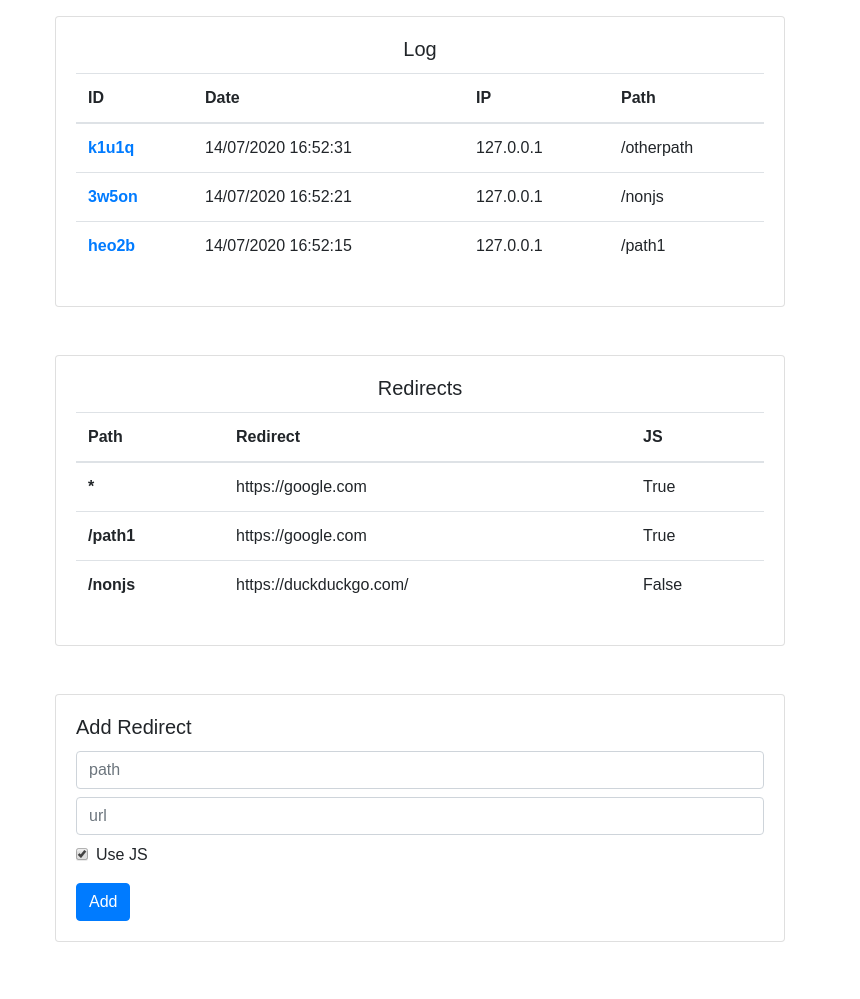
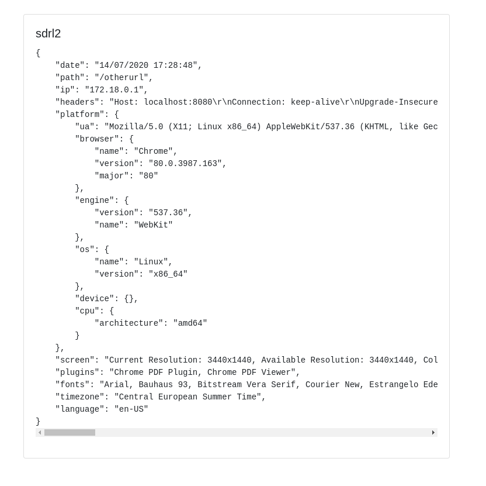

# pygather

Python script to track visitor IP and browser information and redirect him.

It supports:

* Custom redirect links
* Javascript information gathering
* Pure HTTP redirect

## Screenshots

|  |  |
| --- | --- |

## Usage

The admin panel is accessible at `http(s)://<your-url>:<your-port>/admin`

### Docker

Build it

```
docker build -t pygather .
```

Run it

```
docker run -p <your-port>:80 pygather
```

### Native

Create a virtualenv

```
virtualenv --python=python3.6 env
. ./env/bin/activate
```

Install requirements

```
pip install -r requirements.txt
```

Run it

```
gunicorn --bind 0.0.0.0:80 server:app
```