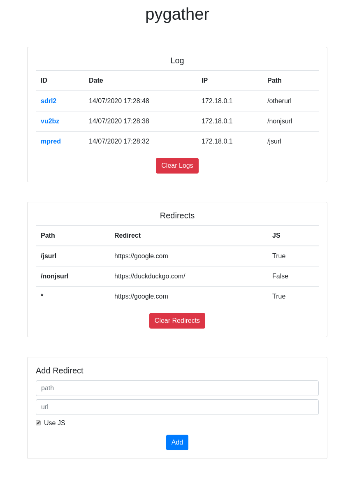

# pygather

Python script to track visitor IP and browser information and redirect him.

It supports:

* Custom redirect links
* Javascript information gathering
* Pure HTTP redirect

## Screenshots

|  |  |
| --- | --- |

